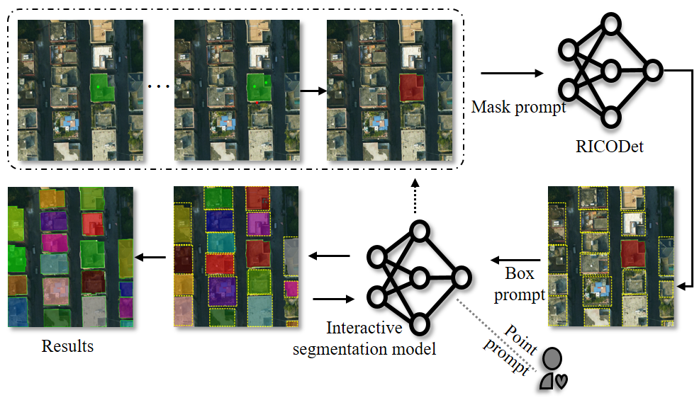
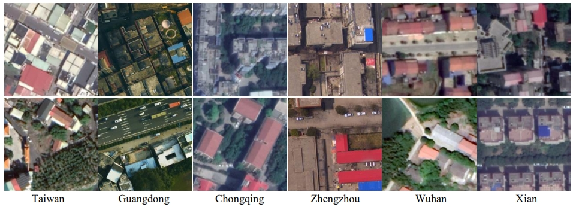
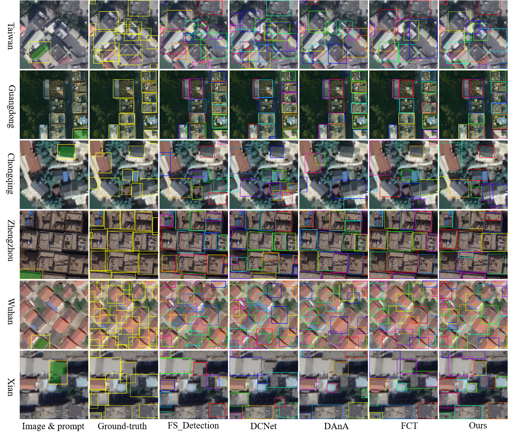
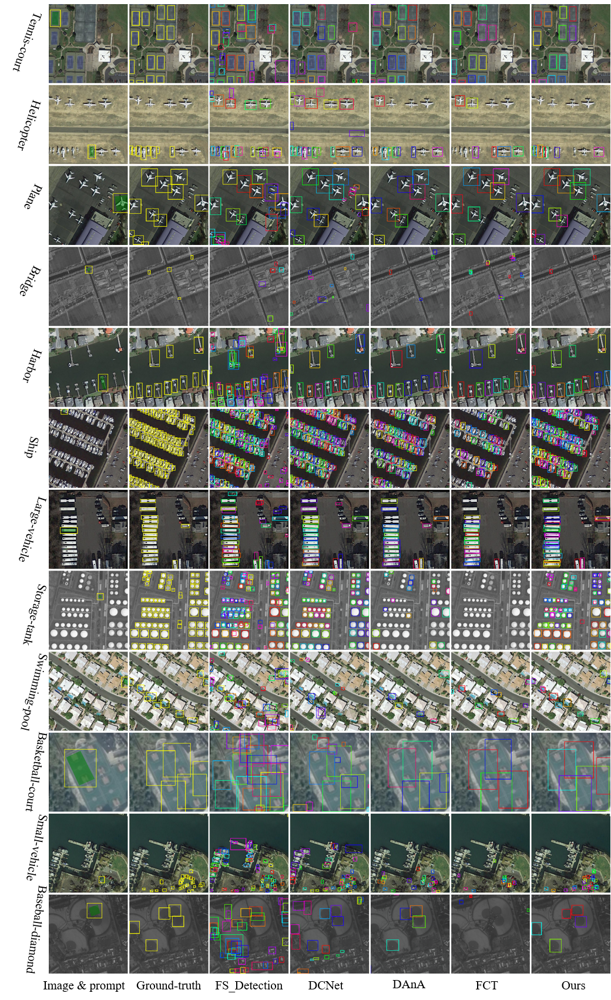
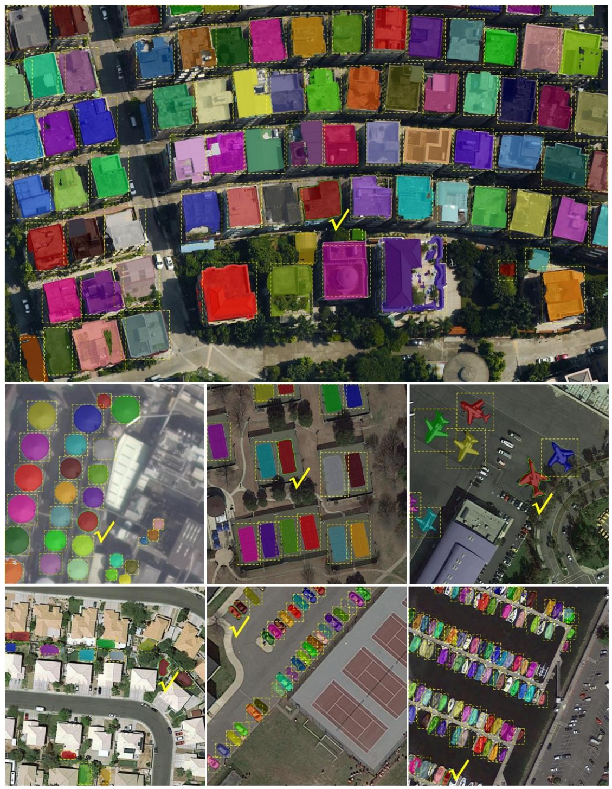
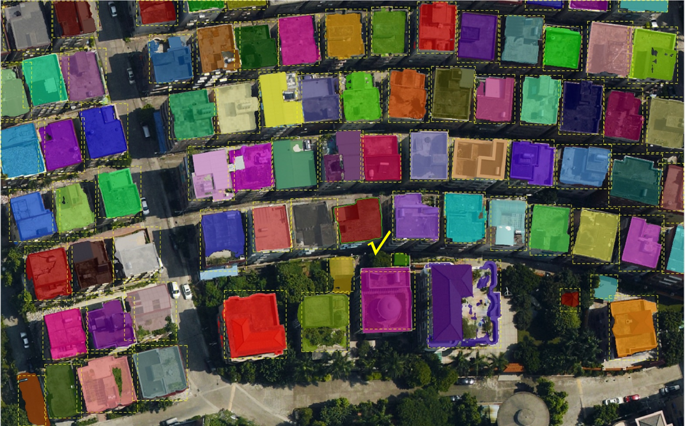

# ICODet

## Title of paper to be published

Faster Interactive Segmentation of Identical-Class Objects with one mask in High-Resolution Remotely sensed Imagery

## 1. Brief description of the proposed method
In this research, we design a new and heuristic fast interactive segmentation (IS) scheme, as shown in Fig.1. 
This scheme first segments a specific building target by an IS model. Subsequently, the segmented target is used
as a support one to retrieve and detect all identical-class ones within the image, marking them with boxes. 
Then, the IS model is applied for precise segmentation of all the boxed targets. Finally, interactive adjustments 
are made for the few targets in the segmentation results that require optimization.   

     
    Fig.1.  A novel heuristic scheme for faster interactive segmentation of all buildings simultaneously. 
The proposed ICODet rapidly detects all objects of the identical class (highlighted with yellow dotted-lineboxes)
in images, guided by a support object with its mask. 

The key innovation in our scheme lies in the introduction of a new task—Identical Class Object Detection (ICOD).
This ICOD task is to query and detect all identical-class objects in an image by a specified-category support target
with its mask. It ingeniously leverages the characteristic of RSI, where geographically proximate identical-class 
objects typically exhibit visual similarity. Based on this, we propose a new Identical-Class Object Detection 
network (ICODet) for detecting objects of the same class at the regional/image level in RSI, as shown in Fig.2. 

     
    Fig.2. The framework of the proposed identical-class object detection network (ICODet) for remote sensing image interactive segmentation. FSCM: Feature Similarity Comparison Module.

## 2. Two publicly available ICOD datasets
We have released a dataset containing buildings from six cities in China. The buildings in this dataset show 
significant differences in characteristics, making it highly suitable for the ICOD task. To address the 
limitation of the dataset covering only a single category, we further introduce the DOTA dataset for 
supplementation. The reorganized data includes 12 different categories, aiming to expand the applicability 
of the target query task.  

     
    Fig.2. Typical building samples of EVLab building dataset.

Two publicly available ICOD datasets:
*  EVLab Building dataset: [EVLab-Building](https://pan.baidu.com/s/1UaqAjwr1-suXNk4J7wNdZg ) (Extraction code:EVLa)
*  The reorganized DOTA2.0 dataset: [DOTA](https://pan.baidu.com/s/1UaqAjwr1-suXNk4J7wNdZg ) (Extraction code:EVLa)

## 3. Experimental results

We compared our proposed method with four recent few-shot object detection methods tailored for the identical-Class
Object Detection (ICOD) task. These four methods were appropriately modified and adjusted to suit the ICOD work.

     
    Fig.3. Visualization of different methods on the EVLab building dataset. In the prediction results, yellow boxes indicate true positives (TP), red boxes indicate false positives (FP), and blue boxes indicate false negatives (FN)

     
    Fig.4. Visualization of different methods on the DOTA dataset. In the prediction results, yellow boxes indicate true positives (TP), red boxes indicate false positives (FP), and blue boxes indicate false negatives (FN)

## 4. Application of faster interactive segmentation
We develop a fast interactive segmentation application using our proposed ICODet for 
remote sensing images. This application initially performs interactive segmentation on a 
support target and then heuristically identifies and segments other identical-class objects within an image. 

1). Image results

     
    Fig.5. Application of fast interactive segmentation using our proposed ICODet.

2). Video results  

<!-- Add a video here -->

